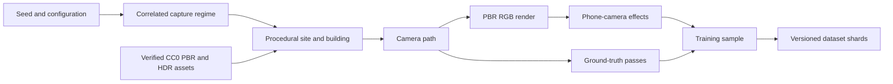

# Synthetic Training Data Generator

## Purpose

The recognition system needs large amounts of varied imagery with exact structural labels. We will generate this with a native Rust/WGPU tool that builds procedural Pizza Hut buildings and surrounding scenes, renders them from realistic camera paths, and writes the images and annotations into versioned training datasets.

The implemented Rust workspace separates deterministic scene sampling, native
WGPU rendering, dataset writing, and asset loading. `roof-synth` is the
headless entry point for generation and validation. Each dataset also carries a
static, visible preview gallery generated from the exact stored RGB and labels;
the gallery is the normal way to review appearance coverage without unpacking
tar shards by hand.

The checked workspace contains a 32-target + 32-negative memorisation corpus
and a 6,000 + 6,000 independent-building training corpus. The full corpus has
one view per building, 48 shards, 54,000 aligned artifacts, and 9,619 train,
1,152 validation, and 1,229 test frames. The reproducible commands and
model-promotion status are kept in [roof training and single-frame
inference](./TRAINING_AND_INFERENCE.md). Generated data is local and gitignored;
a model is not considered available merely because a training command exists.

It is an offline development tool, not part of the browser experience. Runtime roof recognition will never depend on procedural rendering or depth data.

## Shared geometry

The parametric roof implementation must be shared by:

- The native synthetic-data generator.
- The browser roof fitter.
- The Three.js mesh presented to the user.

The geometry should therefore live in a standalone Rust crate that can compile natively and to WASM. This keeps roof parameters, semantic face IDs, structural keypoints, and edge definitions identical across training and runtime.

The current workspace layout is:

```text
crates/
  roof-geometry/       Parametric roofs and semantic structure
  synth-data/           Seeded scene plans, regimes and dataset contracts
  synth-render/         Native WGPU PBR renderer and aligned label passes
tools/
  roof-synth/           Generation, asset loading, sharding and validation CLI
assets/
  synthetic/            Checked-in CC0 PBR materials and HDR environments
```

## Generation pipeline



The unit of generation is an independently sampled building. Still-image
training uses one independently sampled view per building so the 6,000 target
images represent 6,000 geometries rather than repeated views of a small set.
The tool can also render coherent multi-frame paths when explicitly requested
for fitting, temporal-consistency, or scan-guidance tests.

For each sequence, the generator will:

1. Sample a building and roof configuration from a seeded distribution.
2. Select one correlated day phase, site domain, and weather profile for the
   sequence, then derive plausible lighting, exposure, roads, neighbouring
   buildings, vegetation, parking, signage, and site furniture from it.
3. Resolve checked-in PBR materials and an HDR environment by stable manifest
   ID, verifying the source bytes before they reach the renderer.
4. Construct the building, surrounding scene, façade details, and real 3D
   occluders.
5. Generate a coherent camera path with known per-frame intrinsics, transforms,
   zoom behaviour, and framing intent.
6. Render RGB, visible labels, amodal roof labels, and depth from the exact same
   cameras.
7. Apply the current deterministic phone-camera photometric response to RGB
   only. Any future geometric image warp must transform RGB and every affected
   annotation together.
8. Validate visibility, coverage, truncation, asset provenance, and label
   consistency.
9. Write frames and sequence metadata into bounded dataset shards and build the
   visible preview gallery from those stored outputs.

Every sample must be reproducible from its generator version, configuration,
asset hashes, and random seed. `roof-synth` does not rely on an accidental
Monte Carlo hit for the core regimes. Detailed city/urban, suburban, and
roadside/remote domains are grouped into the plan's three required scene
regimes. In the current 6,000 + 6,000 corpus, targets contain exactly 2,000
urban, 2,000 suburban, and 2,000 remote scenes, and negatives repeat those
exact counts; the combined counts are 4,000 each. This exact balance applies to
the complete class and combined corpora, not independently within train,
validation, and test. Stable hash assignment produces 9,619/1,152/1,229
combined split counts, and their natural regime variation is retained rather
than resampled. A minimum of 54 target sequences is needed to combine that
exact overall balance with all 45 detailed roof-morphology × day-phase × domain
cells. The target coverage statement is persisted in `coverage.json`; class,
combined, and split counts are persisted in `scene-regime-balance.json`.

## Generated records

The corrected Burn model consumes only RGB, presence, the twelve amodal
keypoints, and their in-frame/offscreen state. The renderer still persists
masks, semantic IDs, edges, camera state, and exact parameters because they make
the generator auditable and support geometric acceptance tests. They are
validation data, not additional learned heads.

Each frame contains the following source data:

| Output | Purpose |
| --- | --- |
| RGB image | Input to the recognition model |
| Presence class | Positive for target roofs; negative for ordinary buildings |
| Structural keypoints | The twelve amodal eave, shoulder, and crown corners used for training |
| Keypoint state | In-frame, occluded, truncated, or behind-camera state used to select the spatial target or offscreen token |
| Camera and roof parameters | Exact source truth for projection and fitter tests |
| Visible/amodal rasters and semantic IDs | Occlusion, silhouette, and renderer validation only |
| Structural edges and dense face coordinates | Geometry validation and possible offline analysis only |
| Locator and scene metadata | Coverage, truncation, provenance, and stratified review |
| Scene metadata | Materials, lighting, occluders, assets and randomisation choices |

The loader derives each 64×64 Gaussian keypoint distribution and its offscreen
token from compact annotations. Those dense training targets are not stored
redundantly in every shard.

### Keypoint truth and validation geometry

Structural labels come directly from the procedural geometry rather than being rediscovered from rendered pixels:

- Project each known 3D keypoint with the sampled camera model.
- Classify it as visible, occluded, outside the frame, or behind the camera.
- Project semantic roof edges as labelled polylines for validation.
- Clip validation edges against the image and test them against scene occlusion.

The WGPU depth buffer is used internally to test visibility. It is not a saved
model input and does not introduce a runtime depth dependency.

### Truthful occlusion and truncation

Occlusion labels come from geometry and depth, not from requested occlusion
probabilities or 2D cut-outs:

- Vehicles, vegetation, poles, signs, neighbouring buildings, and pedestrians
  are placed as scene geometry and participate in the same depth-tested render
  as the roof.
- The visible semantic pass contains only roof pixels that win against the
  complete scene depth buffer.
- A second roof-only pass uses the identical roof and camera but omits scene
  occluders. Its in-frame pixel count is the amodal denominator.
- `visible_fraction` is visible roof pixels divided by in-frame amodal roof
  pixels. `occluded_fraction` is one minus that value. Crop loss is not counted
  as occlusion; `truncated` is recorded separately when the amodal silhouette
  meets the image boundary.
- Keypoints and sampled validation-edge points are tested against a 3×3 depth
  footprint. Both projected and sampled WGPU depth values are converted back to
  linear camera distance, with a tolerance based on world units per pixel. A
  fixed epsilon in nonlinear depth space is not acceptable at outdoor ranges.

The amodal raster is persisted as `amodal_roof_mask.png` beside the visible
mask. Both visible and amodal in-frame bounds are stored with every frame, so a
training loader can supervise what survives occlusion separately from the full
roof silhouette.

## WGPU renderer

The generator renders offscreen; it does not require a swapchain or visible window. The renderer performs several passes using the same scene, camera, and transforms:

1. Physically based RGB colour with asset-backed material and environment
   sampling.
2. Visible integer instance, semantic-part, and face IDs depth-tested against
   the complete scene.
3. Visible roof-face identity and normalised coordinates.
4. Roof-only amodal IDs, rendered from the same camera for honest occlusion and
   truncation measurements.
5. Complete-scene depth for keypoint and edge visibility.

The current Rust frame contract returns RGB, visible and amodal IDs, face
coordinates, and depth. Surface normals and motion vectors can be added as
explicit auxiliary targets when a training consumer requires them; they are not
silently declared as present in today's shards.

WGPU supplies integer and floating-point texture formats suitable for ID and coordinate passes, including `R32Uint`, `R32Float`, and `Rg16Float`. See the [current wgpu texture formats](https://wgpu.rs/doc/wgpu/enum.TextureFormat.html).

RGB may use anti-aliasing and physically based shading. Discrete label passes must remain exact: no colour management, texture filtering, blending, or anti-aliasing may alter integer class and instance values.

Generation is deliberately bounded: each complete aligned frame is read back,
encoded, validated, and appended before unbounded GPU or compression work can
accumulate. Parallel readback and compression can use a fixed-capacity staging
ring later without changing the deterministic record or shard contracts.

## Public rendering asset pack

The repository owns a compact, redistributable pack at
[`assets/synthetic/`](../assets/synthetic/README.md). Its stable identifier is
`pizzahut-synthetic-public-assets-v1`; the 20 source files total 18,328,942
bytes (approximately 18.3 MB). The
[machine-readable manifest](../assets/synthetic/manifest.json) records the
exact [Poly Haven](https://polyhaven.com/) asset page and download URL, author
and role, [CC0 1.0](https://polyhaven.com/license) licence, dimensions, channel
semantics, byte length, and SHA-256 digest for every file.

The four seamless 1024×1024 PBR sets are:

| Manifest ID | Use | Maps |
| --- | --- | --- |
| `polyhaven_corrugated_iron_02` | Galvanised or repainted metal roofs | diffuse, OpenGL normal, ARM |
| `polyhaven_roof_07` | Weathered clay-tile roofs | diffuse, OpenGL normal, ARM |
| `polyhaven_brick_wall_001` | Brick façades | diffuse, OpenGL normal, ARM |
| `polyhaven_clean_asphalt` | Car parks and roads | diffuse, OpenGL normal, ARM |

The eight 1024×512 linear Radiance HDR panoramas deliberately span all three
day phases and the relevant environment families:

| Manifest ID | Author(s) | Regime coverage |
| --- | --- | --- |
| `polyhaven_kloofendal_43d_clear_puresky` | Greg Zaal | clear, hard-sun daylight |
| `polyhaven_snow_field_puresky` | Jarod Guest; Sergej Majboroda | soft overcast daylight |
| `polyhaven_urban_street_04` | Andreas Mischok | urban daytime |
| `polyhaven_twilight_sunset` | Dimitrios Savva; Jarod Guest | city, urban, and suburban twilight |
| `polyhaven_dikhololo_sunset` | Greg Zaal | roadside and remote twilight |
| `polyhaven_modern_buildings_night` | Greg Zaal | urban night with artificial light |
| `polyhaven_goegap` | Greg Zaal | remote natural/desert daytime |
| `polyhaven_kloppenheim_02` | Greg Zaal | remote natural moonlit night |

The asset catalog requires the stable pack ID, checks that per-file byte lengths
sum to the declared 18,328,942-byte pack total, and verifies every on-disk
length, digest, and decoded dimension before use. Diffuse maps are sampled as
sRGB; OpenGL normal and packed red-AO, green-roughness, blue-metalness maps are
linear; HDR panoramas are decoded to linear floating-point RGBA before WGPU
upload. Every selected file ID and hash is copied into the dataset's
source-asset manifest. Assets derived from a particular real site or capture
carry a split group and stay within one dataset partition. The compact CC0
renderer pack is deliberately shared by every split and remains fully declared,
because these generic materials and skies are not evaluation examples.

## Procedural variation

### Roof and building

- Three weighted, correlated silhouette families derived from all 18 local
  references: `tall_early_crown`, `balanced_classic`, and `low_wide_late`.
  Each family jointly constrains footprint aspect, overhang, shoulder break,
  lower rise, upper rise, and crown taper so random draws remain plausible.
  The selected family is persisted in every sequence record.
- Footprint, eaves, overhang, roof pitch, and crown dimensions.
- Small asymmetries, repairs, damage, and partial remodelling. The configured
  addition weights are 52% none, 42% one, and 6% two. The current full corpus
  realizes 6,208 buildings with none, 5,073 with one, and 719 with two. Its
  6,511 additions comprise 2,891 broad dining wings, 1,489 glazed entrance
  vestibules, and 2,131 service annexes; 3,777 have flat roofs and 2,734 have
  host-facing shed roofs. Addition kind, dimensions, façade, and roof are
  sampled from a target-class-independent RNG stream. The target/negative
  counts are respectively 3,086/3,122 with none, 2,547/2,526 with one, and
  367/352 with two.
- Original red, repainted, faded, stained, patched, metal, tile, and replacement
  roof finishes. Public normal and ARM maps remain physically consistent when
  diffuse colour is tinted.
- Brick, render, cladding, and repaint wall palettes; glazing fraction and tint;
  entrance width; window bands; canopies; gutters; downpipes; and weathering.
- A weighted signage state independent of the recognition label: retained Pizza
  Hut sign, removed-sign ghost/fixings, unrelated tenant sign, or no sign.
  Placement is bounded to a sampled façade; emission is correlated with day
  phase, and removed-sign ghosts never emit light.

### Environment

Scene realism is sampled through correlated profiles rather than unrelated
uniform draws:

- `DayPhase` selects **day**, **twilight**, or **night** and jointly constrains
  solar elevation, camera EV100, sky/direct intensity, colour temperature, and
  artificial site lighting. The default weights are 55/15/30 (about 70%
  day/twilight and 30% night), and validation
  requires positive-weight day and night coverage.
- `SceneDomain` selects **city**, **urban**, **suburban**, **roadside**, or
  **remote**. Each domain jointly controls neighbouring-building density and
  height, vegetation, parking capacity, road kind and lanes, curbs, utility
  poles, overhead wires, and available artificial light. Dataset selection
  balances the requested **urban** (`city` + `urban`), **suburban**, and
  **remote** (`roadside` + `remote`) regimes exactly to within one example for
  both classes; the five detailed domains remain in sequence metadata.
- `WeatherPreset` selects clear, partly cloudy, overcast, hazy, or after-rain
  conditions. Cloud cover, haze, direct and indirect light, shadow softness,
  wetness, atmospheric visibility, and white point come from the same profile.
- The HDR resolver selects an environment compatible with the sampled phase,
  domain, and weather. Day uses urban, natural, or pure-sky daylight; twilight
  uses an urban/suburban or roadside/remote sunset panorama; night uses urban
  artificial light or a remote moonlit panorama. Exposure is varied around the
  sampled camera regime, not used to turn one phase into another.
- Procedural car parks, roads, pavements, neighbouring masses, trees, bushes,
  poles, signs, wires, fences, vehicles, and pedestrians give the panoramas
  local parallax and truthful depth occlusion.
- Reflections, wet surfaces, haze, difficult backlighting, illuminated windows,
  and sign emission follow the same regime rather than independent toggles.

### Camera

The checked still-image corpus deliberately stores one frame per independently
sampled building. It samples a pinhole pose, 52–76 degree horizontal field of
view, apparent scale, and framing intent for that frame. The recorded 12,000
views comprise 2,068 distant, 6,118 normal, 2,019 close, and 1,795 deliberately
partial compositions. Although path kind and zoom intent remain in the
sequence contract for future multi-frame datasets, a one-frame sample cannot
demonstrate temporal camera motion or zoom.

- Camera distance and height remain representative of a person standing outside
  the site, while target-width goals select an appropriate distance for the
  sampled lens.
- Camera distance, collision bounds, background sightlines, partial-framing
  points, and ground extent are computed from the roof actually rendered.
  Ordinary roofs reuse the paired target eave/overhang scale distribution, so
  framing and apparent size cannot reveal the class.
- Coherent path families include orbit, lateral walk, approach arc, and corner
  reveal, with bounded handheld positional sway.
- Each sequence records its initial and final horizontal field of view and one
  of `fixed`, `smooth_in`, or `smooth_out`. Zoom changes continuously across the
  path; it is not simulated by resizing a finished image.
- A deliberate framing intent records centred, partial-left, partial-right,
  partial-top, or partial-bottom composition. Ordinary shots target a roof width
  of 0.38–0.76 of the frame; partial shots target 0.92–1.22 and use a signed
  point-of-interest offset to produce real crop loss.
- Roof-only close framing, façade context, partial shots, and edge truncation
  are all retained as labelled data. Requested composition is only an intent;
  visible coverage and truncation are measured from the render.
- Principal point, orientation, crop, and output resolution are stored per
  frame alongside the exact pose and focal length.
- The currently applied deterministic phone-camera response covers exposure
  residual, white balance and tint, contrast/highlight response, vignetting,
  signal-dependent and read noise, sharpening, highlight bloom, and JPEG
  quality 86–96.
- Lens distortion, motion blur, rolling-shutter warp, and post-render resize
  are not applied in the current corpus. Stored distortion is `none`, and
  partial shots come from the sampled pinhole view and aim rather than a later
  image crop.

If geometric camera operations are added, distortion, crop, rotation,
rolling-shutter warp, and resize must be applied to every affected annotation.
Photometric operations apply only to RGB.

## Negative data

The negative corpus consists of ordinary houses and unrelated buildings. The
implemented renderer samples flat, gable, hip, shed, mansard, pyramid, and
ordinary cupola families. Negative records contain no target keypoints or roof
parameters, and validation rejects accidental target-label leakage.

Positive and negative scenes share the same roof colours, materials, signage,
lighting, backgrounds, distance regimes, and occlusion distributions. Those
features must not reveal the label; the useful distinction is the two-tier roof
geometry. The complete still-image run balances 6,000 independent target
buildings against 6,000 independently sampled ordinary buildings.

Geometrically difficult regular buildings should vary continuously towards the
boundary of the accepted roof family. This teaches structural rejection rather
than letting the model use colour, signage, or context as shortcuts. Current
and former Pizza Hut locations are never deliberately assigned negative labels.

The primary sourced negative corpus is a class-filtered
[Open Images V7](https://storage.googleapis.com/openimages/web/download_v7.html)
subset. A Rust import tool selects human-verified examples from classes such as
`House`, `Building`, `Office building`, and `Skyscraper`,
balances them by apparent building size and scene context, and downloads only
the selected image IDs. It retains the original Open Images split and writes a
manifest containing the image ID, labels, source URL, landing page, author,
declared licence, checksum, and curation status. Bulk source images stay out of
Git.

The current corpus has a digest-bound visual-review ledger covering all 1,161
candidates. It retains 873 exterior ordinary buildings and rejects 288
interiors, objects, unusual structures, obscured crops, and ambiguous frames.
Accepted and rejected paginated sheets remain beside the manifest so this
decision is auditable and reproducible.

Every selected negative must pass metadata/title filtering and visible review;
anything containing the target roof is rejected from the negative corpus. Only
images with acceptable per-image licence metadata are retained. This is
necessary because Open Images explicitly asks users to verify the licence of
each image rather than treating the dataset-level declaration as a warranty.

## Real imagery

Synthetic data provides exact labels and broad control over geometry, coverage, and rare conditions. Real photographs provide the final appearance distribution of actual buildings and phone cameras. Training should mix both rather than trying to make the procedural renderer replace real data.

Real images can also supply backgrounds, materials, camera-noise profiles, and occluder assets for the generator. Dataset splits must remain separated by physical building and source asset so those inputs cannot leak between training and evaluation.

## Dataset format

Generated images should not be committed to Git or written as millions of loose files. The generator writes versioned tar shards using the [WebDataset grouping convention](https://github.com/webdataset/webdataset#the-webdataset-format): files belonging to one sample share a basename, and shards are sequentially numbered.

```text
datasets/synthetic/roof-v003/
  dataset.json
  coverage.json
  generator-config.json
  sequences.json
  train-000000.tar
  train-000001.tar
  validation-000000.tar
  test-000000.tar
  contact-sheet.jpg
  preview/
    index.html
    preview.json
    images/             RGB, masks, and colourised part/face previews
```

A frame within a shard may contain:

```text
01JXYZ.rgb.jpg
01JXYZ.roof_mask.png
01JXYZ.amodal_roof_mask.png
01JXYZ.part_mask.png
01JXYZ.face_ids.png
01JXYZ.facecoords.bin.zst
01JXYZ.labels.json
```

The frame metadata contains its sequence ID, frame index, exact camera, and the
serialized phone-camera appearance profile applied to RGB. The dataset manifest records:

- Dataset schema and version.
- Generator source revision.
- Global configuration and random seed ranges.
- Exact PBR/HDR asset IDs, CC0 licences, source groups, and SHA-256 hashes.
- Label definitions and coordinate conventions.
- Image and target encodings.
- Training, validation, and test split rules.
- Summary counts and distribution statistics.

Splits are assigned by generated building instance, base asset, and procedural family—not by frame. Nearby views of the same generated building must never appear in different splits.

## Command-line tools

Run the native tool from the workspace root:

```bash
cargo run -p roof-synth -- generate \
  --dataset-id synthetic-overfit-balanced \
  --seed 4242 --targets 32 --negatives 32 --frames 1 \
  --width 640 --height 480 \
  --samples-per-shard 64 \
  --output datasets/synthetic-overfit-balanced

cargo run -p roof-synth -- validate datasets/synthetic-overfit-balanced
```

For the complete still-image corpus, change the dataset ID/output to
`synthetic-training-keypoints` and pass `--targets 6000 --negatives 6000`.

Generation writes to a staging directory, validates complete sequences, and
publishes the output directory atomically. It refuses to overwrite a non-empty
dataset directory.

## Visible preview gallery

Every generated dataset must expose `preview/index.html` as a self-contained
static gallery. A successful CLI summary prints its path so reviewers can open
the result directly. The gallery is derived from bytes and annotations already
written to the shards; it must never rerender a scene or silently use different
transforms.

Selection is deterministic and stratified. For a full training run, the gallery
shows every one of the 45 detailed roof-morphology/day-phase/domain cells—all three
silhouettes in day, twilight, and night across city, urban, suburban, roadside,
and remote sites—and includes examples of clear, overcast, hazy, and wet
conditions. It also exposes signage states, roof, façade, and ground material
families, the selected HDR IDs, narrow/standard/wide fields of view,
fixed and smooth zoom, centred and four partial-shot directions, context-density
bins, occluder kinds, and low/medium/high measured occlusion. `preview.json`
records the exact populated coverage categories so an acceptance job can
compare them with the required matrix. A future multi-frame dataset must retain
multiple selected frames from non-fixed zoom sequences so temporal camera
change is directly inspectable; the current one-view corpus audits only the
sampled FOV and framing outcome.

Each card shows:

- RGB at a useful visible size with sequence and frame identity;
- toggles for the aligned roof mask, colourised semantic parts, and face IDs;
- roof morphology, day phase, domain, weather, material families, signage,
  attached-addition kind/roof, camera-path kind, zoom behaviour, and framing intent;
- measured visible fraction, occluded fraction, truncation, public HDR ID,
  source-file IDs, and the deterministic phone-camera response in
  `preview.json`.

The Rust generator also writes `contact-sheet.jpg` plus stratified
`contact-sheet-target-day.jpg`, `contact-sheet-target-night.jpg`,
`contact-sheet-negative-day.jpg`, and `contact-sheet-negative-night.jpg` from
the stored RGB bytes; no external montage tool or second render is involved.
Thumbnails preserve aspect ratio, and discrete-ID previews are colourised
without changing the stored label images. The gallery is review output, not a
substitute for the original RGB or training targets.

## Validation

Generation must fail or explicitly classify a sample when:

- A supposedly visible keypoint fails its depth test.
- Visible roof pixels exceed the amodal in-frame count, or derived visible and
  occluded fractions do not sum to one within tolerance.
- Integer masks contain unknown IDs.
- Projected edges disagree with their corresponding face boundaries.
- When geometric camera augmentation is enabled, RGB and labels use different
  transforms.
- A zoom category disagrees with the stored start and end fields of view, or a
  partial-framing intent is reported as ordinary centred coverage.
- A selected PBR/HDR file fails SHA-256 verification, decoding, dimensions, or
  the material-set channel contract.
- A sampled environment violates its profile, such as direct sun at night,
  unlit city-night context, or domain infrastructure outside its configured
  bounds.
- Required metadata is missing or non-finite.
- The rendered target is accidentally too small, too occluded, or out of frame for its requested sample category.
- Replaying the stored seed and configuration produces different geometry or annotations.
- The preview coverage matrix omits a required day phase, domain, signage state,
  framing/zoom category, material family, or occlusion band represented by the
  dataset.

Golden-seed tests cover the procedural geometry and annotations. RGB pixels may vary slightly across WGPU backends, so image comparisons use a tolerance while integer targets and metadata remain exact.

The preview gallery is part of validation, not decoration. Every dataset version
is reviewed visibly across roof variants, materials, regimes, distances, zoom,
partial framing, occlusion, positives, and hard negatives before it is accepted
for training.

## Optional visual-inertial test output

The same camera paths can produce ideal angular velocity and acceleration, followed by configurable sampling, bias, noise, timing jitter, and dropped events. These streams are useful for deterministic VIO regression and replay tests.

They do not replace recordings from real iPhones. Real device sessions remain the source for sensor conventions, camera/sensor timing, rolling-shutter behaviour, and realistic motion-noise profiles.

## Completion criteria

The synthetic-data system is complete when it can:

- Generate reproducible target and ordinary-building scenes headlessly.
- Preserve correlated day/twilight/night, weather, and
  city/urban/suburban/roadside/remote scene regimes in every sequence record.
- Keep the plan-level urban, suburban, and remote counts within one for targets,
  ordinary negatives, and the combined corpus, with the exact audit in
  `scene-regime-balance.json`.
- Verify and record the exact CC0 PBR/HDR bytes used by every rendered scene.
- Render RGB and all required structural annotations from the same camera state.
- Derive occlusion from visible and amodal depth-tested renders while keeping
  crop truncation independent.
- Recreate any sample from its recorded seed and manifest.
- Inspect every target, implemented photometric response, regime, and camera
  composition in the visible static preview gallery.
- Write bounded, versioned, training-ready shards without loose-file sprawl.
- Share the exact roof geometry and semantic definitions used by the browser fitter.
- Validate label integrity automatically before a shard is accepted.
- Supply enough controlled variation that the model must recognise roof structure rather than colour, signage, or background context.
