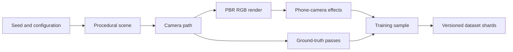

# Synthetic Training Data Generator

## Purpose

The recognition system needs large amounts of varied imagery with exact structural labels. We will generate this with a native Rust/WGPU tool that builds procedural Pizza Hut buildings and surrounding scenes, renders them from realistic camera paths, and writes the images and annotations into versioned training datasets.

The generator has two front ends over the same scene and rendering libraries:

- A deterministic, headless CLI for batch generation.
- A small interactive viewer for inspecting scenes, annotations, and individual dataset samples.

It is an offline development tool, not part of the browser experience. Runtime roof recognition will never depend on procedural rendering or depth data.

## Shared geometry

The parametric roof implementation must be shared by:

- The native synthetic-data generator.
- The browser roof fitter.
- The Three.js mesh presented to the user.

The geometry should therefore live in a standalone Rust crate that can compile natively and to WASM. This keeps roof parameters, semantic face IDs, structural keypoints, and edge definitions identical across training and runtime.

A suitable workspace layout is:

```text
crates/
  roof-geometry/       Parametric roofs and semantic structure
  synth-scene/         Buildings, environments and randomisation
  synth-render/        WGPU renderer and label passes
apps/
  roof-synth/          Headless dataset CLI
  roof-synth-viewer/   Interactive inspector
```

## Generation pipeline



The unit of generation is a short, coherent camera sequence around one building. Individual frames can be shuffled for recognition training, while the sequence remains available for testing multi-view fitting, temporal consistency, coverage, and scan guidance.

For each sequence, the generator will:

1. Sample a building and roof configuration from a seeded distribution.
2. Construct the building, surrounding scene, materials, lighting, and occluders.
3. Generate a realistic camera path with known intrinsics and transforms.
4. Render RGB and ground-truth passes from the exact same cameras.
5. Apply geometric camera effects consistently to RGB and labels.
6. Apply photometric camera effects to RGB only.
7. Validate visibility, coverage, and label consistency.
8. Write the frames and sequence metadata into bounded dataset shards.

Every sample must be reproducible from its generator version, configuration, asset hashes, and random seed.

## Generated labels

Each frame contains the following source data:

| Output | Purpose |
| --- | --- |
| RGB image | Input to the recognition model |
| Roof mask | Target presence and full roof silhouette |
| Semantic-part mask | Main slopes, crown faces, overhangs and other roof parts |
| Face-ID map | Stable identity for each parametric roof face |
| Face-coordinate map | Normalised coordinates within each roof face |
| Structural keypoints | Eaves, ridges, valleys, crown corners and endpoints |
| Keypoint visibility | Visible, occluded, truncated or behind the camera |
| Structural edges | Projected polylines, semantic classes and tangent directions |
| Camera data | Intrinsics, distortion, crop and world transform |
| Roof data | World transform, variant and parametric dimensions |
| Locator data | Bounding box, coverage, truncation and target/reject class |
| Scene metadata | Materials, lighting, occluders, assets and randomisation choices |

Dense training targets that are cheap to derive—such as keypoint heatmaps and per-pixel vectors towards keypoints—should be generated by the dataset loader from compact annotations. They do not need to be stored redundantly for every frame.

### Keypoints, edges, and visibility

Structural labels come directly from the procedural geometry rather than being rediscovered from rendered masks:

- Project each known 3D keypoint with the sampled camera model.
- Classify it as visible, occluded, outside the frame, or behind the camera.
- Project semantic roof edges as labelled polylines.
- Clip edges against the image and test them against scene occlusion.
- Preserve their semantic class and image-space tangent direction.

The WGPU depth buffer is used internally to test visibility. It is not a saved model input and does not introduce a runtime depth dependency.

## WGPU renderer

The generator renders offscreen; it does not require a swapchain or visible window. The renderer performs several passes using the same scene, camera, and transforms:

1. Physically based RGB colour.
2. Integer instance and semantic-part IDs.
3. Roof-face identity and normalised coordinates.
4. Surface normals for inspection and possible auxiliary experiments.
5. Depth for internal visibility testing.
6. Optional motion vectors for integrated tracking tests.

WGPU supplies integer and floating-point texture formats suitable for ID and coordinate passes, including `R32Uint`, `R32Float`, and `Rg16Float`. See the [current wgpu texture formats](https://wgpu.rs/doc/wgpu/enum.TextureFormat.html).

RGB may use anti-aliasing and physically based shading. Discrete label passes must remain exact: no colour management, texture filtering, blending, or anti-aliasing may alter integer class and instance values.

For throughput, the batch renderer keeps several jobs in flight, copies completed targets into a ring of staging buffers, maps them asynchronously, and sends the resulting data to compression and shard-writer threads. Generation remains bounded so GPU readback or disk compression cannot grow an unbounded queue.

## Procedural variation

### Roof and building

- Known Pizza Hut roof variants and proportion ranges.
- Footprint, eaves, overhang, roof pitch, and crown dimensions.
- Small asymmetries, repairs, damage, extensions, and partial remodelling.
- Original red, repainted, faded, stained, patched, and replacement materials.
- Wall materials, windows, awnings, entrances, gutters, and downpipes.
- Current signs, removed-sign outlines, unrelated tenants, and no signage.
- HVAC equipment, vents, aerials, and rooftop clutter.

### Environment

- Geographic and seasonal material palettes.
- Time of day, sky, sun direction, cloud cover, and shadow softness.
- Car parks, roads, pavements, neighbouring buildings, and landscaping.
- Trees, bushes, poles, signs, wires, fences, vehicles, and pedestrians.
- Foreground and roof-level occlusion.
- Reflections, wet surfaces, haze, and difficult backlighting.

### Camera

- Camera distance and height representative of a person standing outside the site.
- Lateral, forward/backward, and curved paths around the building.
- Focal length, principal point, orientation, crop, and output resolution.
- Partial framing, roof-only framing, and building-edge truncation.
- Exposure, white balance, sensor noise, sharpening, and compression.
- Lens distortion, motion blur, rolling-shutter approximation, and resize artefacts.

Geometric camera operations—distortion, crop, rotation, rolling-shutter warp, and resize—must be applied to every affected annotation. Photometric operations apply only to RGB.

## Negative data

The generator must produce both empty scenes and deliberate near misses:

- Ordinary hip and gable roofs.
- Mansard roofs.
- Petrol-station canopies.
- Other fast-food buildings.
- Roofs with a vaguely similar central crown.
- Modern Pizza Hut buildings without the classic roof.
- Former Pizza Huts altered beyond the accepted target family.
- Pizza Hut-like materials and colours applied to unrelated geometry.

Near misses should vary continuously towards the boundary of the accepted roof family. This teaches the model structural rejection rather than letting it use colour, signage, or context as shortcuts.

## Real imagery

Synthetic data provides exact labels and broad control over geometry, coverage, and rare conditions. Real photographs provide the final appearance distribution of actual buildings and phone cameras. Training should mix both rather than trying to make the procedural renderer replace real data.

Real images can also supply backgrounds, materials, camera-noise profiles, and occluder assets for the generator. Dataset splits must remain separated by physical building and source asset so those inputs cannot leak between training and evaluation.

## Dataset format

Generated images should not be committed to Git or written as millions of loose files. The generator writes versioned tar shards using the [WebDataset grouping convention](https://github.com/webdataset/webdataset#the-webdataset-format): files belonging to one sample share a basename, and shards are sequentially numbered.

```text
datasets/synthetic/roof-v003/
  dataset.json
  train-000000.tar
  train-000001.tar
  validation-000000.tar
  test-000000.tar
```

A frame within a shard may contain:

```text
01JXYZ.rgb.jpg
01JXYZ.parts.png
01JXYZ.facecoords.bin.zst
01JXYZ.labels.json
```

The frame metadata contains its sequence ID and frame index. The dataset manifest records:

- Dataset schema and version.
- Generator source revision.
- Global configuration and random seed ranges.
- Asset identifiers, licences, and content hashes.
- Label definitions and coordinate conventions.
- Image and target encodings.
- Training, validation, and test split rules.
- Summary counts and distribution statistics.

Splits are assigned by generated building instance, base asset, and procedural family—not by frame. Nearby views of the same generated building must never appear in different splits.

## Command-line tools

The intended interface is:

```bash
roof-synth generate \
  --config configs/roof-training.toml \
  --seed 42 \
  --output datasets/synthetic/roof-v003

roof-synth inspect \
  datasets/synthetic/roof-v003 \
  --sample 01JXYZ

roof-synth replay --sample 01JXYZ

roof-synth validate datasets/synthetic/roof-v003
```

The interactive viewer uses the same renderer and can switch between RGB, masks, face coordinates, normals, keypoints, edges, visibility, and camera paths. It also overlays decoded annotations onto RGB so projection or transform errors are immediately visible.

## Validation

Generation must fail or explicitly classify a sample when:

- A supposedly visible keypoint fails its depth test.
- Integer masks contain unknown IDs.
- Projected edges disagree with their corresponding face boundaries.
- Geometric camera augmentation and labels use different transforms.
- Required metadata is missing or non-finite.
- The rendered target is accidentally too small, too occluded, or out of frame for its requested sample category.
- Replaying the stored seed and configuration produces different geometry or annotations.

Golden-seed tests cover the procedural geometry and annotations. RGB pixels may vary slightly across WGPU backends, so image comparisons use a tolerance while integer targets and metadata remain exact.

The viewer is part of this validation process: every dataset version should be sampled visually across roof variants, materials, distances, occlusion levels, positives, and hard negatives before it is accepted for training.

## Optional visual-inertial test output

The same camera paths can produce ideal angular velocity and acceleration, followed by configurable sampling, bias, noise, timing jitter, and dropped events. These streams are useful for deterministic VIO regression and replay tests.

They do not replace recordings from real iPhones. Real device sessions remain the source for sensor conventions, camera/sensor timing, rolling-shutter behaviour, and realistic motion-noise profiles.

## Completion criteria

The synthetic-data system is complete when it can:

- Generate reproducible positive, negative, and near-miss scene sequences headlessly.
- Render RGB and all required structural annotations from the same camera state.
- Recreate any sample from its recorded seed and manifest.
- Inspect every target and transformation in the interactive viewer.
- Write bounded, versioned, training-ready shards without loose-file sprawl.
- Share the exact roof geometry and semantic definitions used by the browser fitter.
- Validate label integrity automatically before a shard is accepted.
- Supply enough controlled variation that the model must recognise roof structure rather than colour, signage, or background context.

