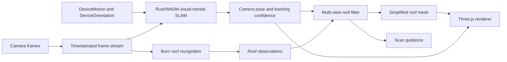

# Retro Pizza Hut Roof AR: Implementation Plan

## Goal

Build a browser-based AR experience that recognises the classic Pizza Hut roof, tracks the user's camera as they move around a building, fits a simplified roof mesh to the observations, and renders a stable overlay.

The primary target is iOS Safari. The tracking system will use both camera images and device motion sensors; it will not be an image tracker with incidental orientation hints. Android can use WebXR/ARCore when available, but the product will not depend on that path.

The overlay needs convincing position, orientation, proportions, and stability. It does not need survey-grade dimensions. Moving the phone through space gives the visual-inertial tracker and roof fitter more parallax and acceleration information, allowing scale and alignment to settle as the scan progresses.

Runtime depth data is not part of the design. At the likely viewing distance, phone depth sensors would not be useful enough to justify making them a dependency.

## System architecture



The main subsystems are deliberately separate:

- Rust/WASM visual-inertial SLAM owns camera tracking and the scene map.
- Burn owns learned roof recognition, using WGPU/WebGPU when available.
- The roof fitter combines recognition results from multiple camera poses.
- Three.js only renders the camera presentation, mesh, and guidance UI.

They exchange frame IDs, timestamps, transforms, calibration revisions, observations, and confidence. They do not need to share a WebGL or WebGPU context.

## Camera and motion acquisition

The launch action requests all required access from the same user gesture:

- Rear camera through `getUserMedia()`.
- Motion through `DeviceMotionEvent.requestPermission()` where required.
- Orientation through `DeviceOrientationEvent.requestPermission()` where required.

Each camera frame is recorded as an immutable frame object containing:

- A monotonically increasing frame ID.
- Capture, media, presentation, and callback timestamps when available.
- Dimensions, orientation, crop, mirroring, and model-input transform.
- The active camera-calibration revision.
- The camera pose eventually associated with that exact frame.

Motion samples are collected continuously rather than only when a camera frame arrives. For each sample we retain the event timestamp, immediate `performance.now()` timestamp, sampling interval, rotation rate, acceleration, acceleration including gravity, and screen orientation.

This follows the useful part of the visible 8th Wall pipeline: it [collects all three motion measurements](../references/8thwall/reality/app/xr/js/src/sensors.ts), [stages the sensor batch with camera frames](../references/8thwall/reality/app/xr/js/src/tracking-controller.ts), and includes [iOS-specific timing and axis corrections](../references/8thwall/reality/engine/tracking/tracking-sensor-event.cc).

## Visual-inertial SLAM

The iOS pose provider is a real visual-inertial estimator. Visual features and inertial measurements participate in the same sliding-window optimisation.

### Visual front end

- Build a grayscale image pyramid for every tracking frame.
- Detect grid-distributed Shi-Tomasi or FAST features.
- Track them with pyramidal Lucas-Kanade and forward/backward checks.
- Use gyro prediction to narrow feature-search windows and handle fast rotation.
- Compute ORB-style descriptors on keyframes for wide-baseline matching and relocalisation.
- Reject moving people, vehicles, foliage, sky, reflections, and other unreliable regions where possible.
- Detect low-parallax and mostly planar motion so the guidance system can ask for a better view.

### Visual-inertial estimator

The fixed-lag estimator maintains:

- Camera/body orientation and position.
- Velocity.
- Gyroscope and accelerometer biases.
- Gravity direction.
- Camera intrinsics and limited distortion.
- Camera-to-device rotation.
- Camera-to-motion time offset.
- Inverse-depth scene landmarks.

It combines visual reprojection factors with bias-aware IMU preintegration. Browser camera and sensor timestamps are aligned continuously using visual rotation versus integrated gyro rotation. Rolling-shutter compensation uses the gyro and a calibrated readout-time prior.

`DeviceOrientation` helps initialise gravity-aligned attitude and provides a low-frequency integrity check. The high-rate motion estimate comes from `rotationRate` and acceleration measurements rather than treating orientation events as the tracker.

### Mapping and recovery

- Select and retain keyframes outside the active optimisation window.
- Maintain descriptors for relocalisation after interruptions or tracking loss.
- Add verified loop constraints and smoothly correct accumulated drift.
- Preserve motion samples across dropped camera frames.
- Predict the most recent optimised pose forward to display time using fresh gyro samples.
- Restart timing and calibration epochs after camera changes, page suspension, orientation changes, or long sensor gaps.

The tracker exposes useful states such as initialising, tracking, limited, relocalising, and lost, together with confidence and a reason. The UI uses those states to guide the user instead of allowing a poor pose to produce a visibly unstable mesh.

## Roof recognition

Recognition is structural rather than colour-dependent. The model runs in two passes:

1. A low-resolution full-frame model finds likely roof regions.
2. A higher-resolution ROI model extracts the evidence needed for fitting.

The ROI model produces:

- Roof and roof-part masks.
- Structural keypoints with visibility and uncertainty.
- Ridge, eave, valley, crown, and silhouette edges.
- Roof-face identity and normalised face coordinates.
- Prototype or variant likelihood.
- Reject, truncation, blur, and coverage scores.

Training data should aggressively vary roof colour, repainting, weathering, materials, lighting, occlusion, signs, extensions, and surrounding architecture. It should include many hard negatives such as ordinary hip roofs, mansards, petrol stations, other restaurant roofs, and heavily altered former Pizza Huts.

The existing [recognition research](./CHATGPT_RESEARCH.md) remains a useful source for the model and dataset details. The complete offline generation pipeline, render passes, annotation schema, storage format, and validation rules are specified in the [synthetic training data plan](./SYNTHETIC_TRAINING_DATA.md).

## Multi-view roof fitting

Generic scene features establish the camera trajectory. Roof detections are then attached to the camera pose of their source frame and accumulated across the scan.

The roof is represented by a small family of watertight, piecewise-planar parametric meshes. Parameters cover:

- Footprint width and depth.
- Eave height and overhang.
- Main roof pitches.
- Crown width, depth, height, and slopes.
- Building-relative pose and roof variant.
- Small, bounded asymmetries where the observations support them.

The fitter keeps several plausible front/back and variant hypotheses until the views distinguish them. It optimises one shared roof mesh against all accepted observations using:

- Keypoint reprojection.
- Face-coordinate reprojection.
- Silhouette alignment.
- Structural-edge distance and orientation.
- Gravity and vertical constraints.
- Camera-pose and observation confidence.
- Loose priors on recognisable Pizza Hut roof proportions.

The roof only becomes a SLAM landmark after repeated, geometrically consistent recognition. A single false detection must not be able to pull the camera map out of alignment.

### Overlay scale and alignment

There is no requirement to recover certified absolute dimensions. The mesh is fitted in the same evolving world coordinate system as the camera trajectory, which is sufficient for rendering the overlay.

As the user moves laterally and towards or away from the building, visual parallax, device acceleration, gravity, and the roof's shape constraints improve the relative scale, depth, and pose estimate. The overlay can transition smoothly from a loose fit to a stable fit as those observations accumulate.

The guidance system should ask for more translation or another corner whenever the current views leave scale or depth ambiguous. No depth sensor, known building measurement, or manual scale input is required.

## Scan guidance

Guidance is driven by the actual uncertainty in tracking and roof fitting. It can ask the user to:

- Hold briefly while motion timing and gravity settle.
- Move the phone gently through 3D space to initialise visual-inertial tracking.
- Step sideways for stronger parallax.
- Move towards or away from the building when scale is weak.
- Capture another corner or a missing roof face.
- Slow down when blur or rolling-shutter error is too high.
- Return to a previously mapped view for relocalisation.

This is more useful than a fixed scan animation because it responds to what the optimiser still needs.

## Rendering and inference

Three.js rendering and recognition are independent camera consumers.

- Prefer a CSS `<video>` camera layer behind a transparent Three.js canvas. This avoids uploading camera pixels into Three.js merely to display them.
- The SLAM worker consumes downscaled luma at camera cadence.
- The Burn worker consumes selected RGB frames or ROIs, owns its own WGPU device, and returns compact roof observations.
- Recognition runs with one frame in flight and drops stale requests rather than building a queue.
- The renderer reads the latest predicted camera pose and the latest accepted mesh state.

The visible 8th Wall implementation follows the same separation in principle: it maintains [distinct compute and draw contexts](../references/8thwall/reality/app/xr/js/src/session-manager-getusermedia.ts) and uploads the camera image to them independently.

On devices with WebGPU, Burn uses its WGPU backend. Older devices use Burn's WASM CPU backend. Sparse tracking, RANSAC, bundle adjustment, marginalisation, and roof fitting remain in CPU WASM because their small irregular workloads are better suited to it.

Serve the application cross-origin isolated so `SharedArrayBuffer` and WASM threads are available:

```http
Cross-Origin-Opener-Policy: same-origin
Cross-Origin-Embedder-Policy: require-corp
```

## Rust and TypeScript stack

| Role | Planned implementation |
| --- | --- |
| Browser application | TypeScript, React, Three.js |
| Browser bindings | `wasm-bindgen`, `web-sys`, `js-sys` |
| Learned inference | Burn with WGPU/WebGPU and WASM CPU artifacts |
| Per-frame tracking | Rust/WASM SIMD; audited KLT and feature-detection code |
| Linear algebra | `nalgebra` plus small owned fixed-size kernels where useful |
| Robust geometry | Audited five-point, PnP, triangulation, and RANSAC implementations |
| VIO optimisation | Owned fixed-lag sparse solver and marginalisation layer, informed by Basalt and other reference implementations |
| Roof optimisation | Small robust least-squares solver over the parametric mesh |

`kornia-rs`, `visloc-rs`, Basalt, and the checked-out 8th Wall plumbing are reference and algorithm sources rather than drop-in runtime foundations. Burn is the maintained inference framework used directly.

## Implementation workstreams

These workstreams make up the complete system; the numbering describes integration dependencies rather than separate product versions.

1. **Capture and replay:** implement permission flow, camera and sensor collection, immutable frame records, timestamp alignment, recording, and deterministic replay.
2. **Visual-inertial tracking:** implement the visual front end, IMU preintegration, initialisation, fixed-lag optimisation, mapping, relocalisation, and display-time prediction.
3. **Recognition pipeline:** implement the [synthetic training data generator](./SYNTHETIC_TRAINING_DATA.md), training-data format, full-frame locator, ROI model, Burn export, backend selection, and inference worker.
4. **Parametric roof system:** implement roof variants, observation decoding, hypothesis generation, multi-view fitting, uncertainty, and mesh output.
5. **Guidance and state:** connect estimator and fitter uncertainty to camera-motion prompts, coverage feedback, recovery, and lock/unlock behaviour.
6. **Three.js integration:** render the camera presentation, tracking guidance, diagnostic overlays, and smoothed roof mesh without coupling rendering to inference.
7. **Device calibration and field testing:** profile supported iPhones, tune timing and sensor conventions, collect real buildings and hard negatives, and compare tracking behaviour with 8th Wall on the same devices.

## Completion criteria

The system is ready when it can:

- Request and materially use camera and motion data on iOS Safari.
- Initialise from an ordinary coached phone movement without markers or depth.
- Maintain a stable gravity-aligned camera trajectory around a building.
- Relocalise after short interruptions and recover without jumping the overlay.
- Reject non-Pizza-Hut roofs and avoid locking on one-frame false positives.
- Fit a recognisable simplified roof from several practical viewing angles.
- Refine alignment as the user moves and keep the final overlay visually attached to the building.
- Run tracking continuously while recognition, fitting, guidance, and rendering stay within the device's sustained thermal budget.
- Replay recorded sessions deterministically for regression testing.

The core product decision is straightforward: own the iOS visual-inertial tracker, recognition, reconstruction, guidance, and rendering; use platform tracking opportunistically where it improves the result; and design the scan around the information that ordinary camera and motion access can reliably provide.
